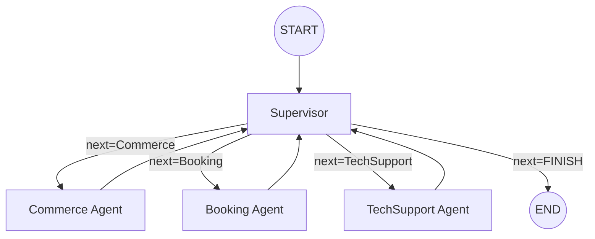

<p align="center">
  <strong>V I N A U A V</strong><br/>
  <em>Multi-Agent Intelligence System — Technical Specification</em>
</p>

<p align="center">
  <code>CLASSIFICATION: INTERNAL — ENGINEERING REFERENCE</code><br/>
  <code>REVISION: 1.0.0 · 2026-03-14</code>
</p>

---

# AGENTS.md — VinaUAV Multi-Agent Architecture

> **Mission Statement:** VinaUAV's agent system provides an autonomous, conversational command layer for drone education commerce, scheduling, and technical support — deployed at the edge on Cloudflare Workers with zero cold-start latency.

---

## Table of Contents

1. [System Architecture](#1-system-architecture)
2. [Detailed Agent Specifications](#2-detailed-agent-specifications)
3. [Tool Registry](#3-tool-registry)
4. [Workflow Examples](#4-workflow-examples)
5. [Security & Authentication](#5-security--authentication)
6. [Infrastructure & Deployment](#6-infrastructure--deployment)

---

## 1. System Architecture

### 1.1 High-Level Overview

The VinaUAV agent system is a **multi-agent state graph** built on [LangGraph](https://github.com/langchain-ai/langgraphjs) and deployed as a Cloudflare Worker via [Hono](https://hono.dev). It follows a **Supervisor–Worker** topology where a central routing agent delegates tasks to specialised domain agents.

```
┌─────────────────────────────────────────────────────────────────┐
│                     CLOUDFLARE WORKERS EDGE                     │
│                                                                 │
│   ┌──────────┐      ┌─────────────────────────────────────┐     │
│   │  Zalo /  │      │         LangGraph StateGraph        │     │
│   │ Webhook  │─────▶│                                     │     │
│   │ Ingress  │      │   ┌───────────┐                     │     │
│   └──────────┘      │   │SUPERVISOR │◀──── START          │     │
│                      │   │  (Router) │                     │     │
│                      │   └─────┬─────┘                     │     │
│                      │         │ conditional_edges          │     │
│                      │    ┌────┼────┬────────────┐          │     │
│                      │    ▼    ▼    ▼            ▼          │     │
│                      │ Commerce Booking TechSupport  FINISH │     │
│                      │    │    │    │            │          │     │
│                      │    └────┴────┴────────────┘          │     │
│                      │         │ (all loop back             │     │
│                      │         │  to Supervisor)            │     │
│                      └─────────┴───────────────────────────┘     │
│                                                                 │
│   ┌──────────┐    ┌──────────┐    ┌──────────┐                  │
│   │    KV    │    │    D1    │    │ Workers  │                  │
│   │  (State) │    │  (Data)  │    │   AI     │                  │
│   └──────────┘    └──────────┘    └──────────┘                  │
└─────────────────────────────────────────────────────────────────┘
```

### 1.2 The Think → Act → Observe Loop

Every agent in the system operates on the **ReAct (Reasoning + Acting)** paradigm via `createReactAgent` from `@langchain/langgraph/prebuilt`:

| Phase       | Description                                                                                                          |
| ----------- | -------------------------------------------------------------------------------------------------------------------- |
| **Think**   | The LLM receives the system prompt + conversation history and determines what action to take next.                   |
| **Act**     | The agent invokes a registered tool (e.g., `check_inventory`, `book_appointment`) with structured Zod-validated I/O. |
| **Observe** | The tool returns a result string. The LLM observes the output and decides to either call another tool or respond.    |

This loop executes **autonomously within each worker agent** until the agent produces a final answer, which is then forwarded back to the Supervisor node.

### 1.3 State Management & Persistence

#### Cloudflare KV — Conversational Memory

| Parameter          | Value                                                                              |
| ------------------ | ---------------------------------------------------------------------------------- |
| **Binding**        | `CHAT_CONTEXT`                                                                     |
| **Key Pattern**    | `thread:{chatId}`                                                                  |
| **Value Schema**   | `Array<{ type: "human" \| "ai", content: string }>`                                |
| **TTL**            | `1800s` (30 minutes sliding window)                                                |
| **Context Window** | Last 10 messages retained per thread                                               |
| **Purpose**        | Short-term conversational memory enabling multi-turn dialogue across HTTP requests. |

```typescript
// Persist thread state back to KV (sliding window: last 10 messages)
const messagesToSave = outMessages
  .map((m) => ({ type: m._getType(), content: m.content }))
  .slice(-10);
await env.CHAT_CONTEXT.put(threadKey, JSON.stringify(messagesToSave));
```

#### Cloudflare D1 — Transactional Persistence

| Table              | Columns                                                | Purpose                                 |
| ------------------ | ------------------------------------------------------ | --------------------------------------- |
| `inventory`        | `id`, `name`, `stock`, `price`, `description`          | Flight controller boards & components   |
| `orders`           | `orderId`, `chatId`, `amount`, `memo`, `status`        | Payment-linked orders (SePay pipeline)  |
| `orders_legacy`    | `id`, `user_id`, `item_id`, `quantity`, `status`       | Legacy order tracking for direct orders |

**D1 ORM** (`services/db.ts`) provides a typed abstraction layer:
- `getInventoryItem(name)` — Fuzzy LIKE search against product catalog
- `createOrder(userId, itemId, quantity)` — Insert pending order
- `createPaymentOrder(orderId, chatId, amount, memo)` — Create SePay-linked payment record
- `completeOrderStatus(memo, amount)` — Mark order as completed on webhook confirmation

### 1.4 LangGraph StateGraph Definition

The core orchestration state is defined as:

```typescript
const AgentState = Annotation.Root({
  messages: Annotation<BaseMessage[]>({
    reducer: (x, y) => x.concat(y),   // Append-only message history
    default: () => [],
  }),
  next: Annotation<string>({
    reducer: (x, y) => y ?? x,        // Latest routing decision wins
    default: () => "Supervisor",
  }),
});
```

The `next` field drives the **conditional edge routing** — after the Supervisor evaluates, the graph traverses to the designated worker node or terminates at `END`.

---

## 2. Detailed Agent Specifications

### 2.1 Supervisor Agent — *Flight Director*

> *"The tower that coordinates all inbound and outbound traffic."*

| Attribute            | Detail                                                                                               |
| -------------------- | ---------------------------------------------------------------------------------------------------- |
| **Role**             | Central router & task dispatcher                                                                     |
| **Graph Node**       | `Supervisor`                                                                                         |
| **Edge**             | `START → Supervisor` (entry point)                                                                   |
| **Downstream Nodes** | `Commerce`, `Booking`, `TechSupport`, `FINISH`                                                       |
| **Source**           | [`agents/supervisor.ts`](workers/zalo-bot/src/agents/supervisor.ts)                                   |

#### Routing Mechanism

The Supervisor uses **forced tool calling** (`tool_choice: "route"`) to ensure deterministic routing. The LLM is bound to a single `route` tool with a constrained Zod enum:

```typescript
const routeTool = tool(
  async ({ next }) => `Routing to ${next}`,
  {
    name: "route",
    description: "Select the next worker to route the user's request to.",
    schema: z.object({
      next: z.enum(["Commerce", "Booking", "TechSupport", "FINISH"])
    }),
  }
);
```

#### Prompt Strategy

```
SYSTEM: You are a supervisor managing a conversation between the user and the
following workers: Commerce, Booking, TechSupport. Given the following user request,
respond with the worker to act next. If the request has been fully resolved or you
want to respond to the user, respond with FINISH.
```

**Design rationale:** The prompt is intentionally minimal and directive. The Supervisor should *never* answer user questions directly — it exists solely to classify intent and delegate. The forced tool call eliminates free-text responses, ensuring the output is always a valid routing decision.

#### Control Flow



After any worker completes, control returns to the Supervisor for potential follow-up routing (e.g., a user request that spans multiple domains).

---

### 2.2 Commerce Agent — *Loadout Specialist*

> *"Your quartermaster for flight controller boards, components, and field gear."*

| Attribute        | Detail                                                                                           |
| ---------------- | ------------------------------------------------------------------------------------------------ |
| **Role**         | Product catalog lookup, order placement, and payment QR generation                               |
| **Architecture** | ReAct Agent (`createReactAgent`)                                                                 |
| **Graph Node**   | `Commerce`                                                                                       |
| **Tools**        | `check_inventory`, `place_order`, `generate_payment_qr`                                          |
| **Source**       | [`agents/commerce.ts`](workers/zalo-bot/src/agents/commerce.ts)                                   |

#### System Prompt

```
SYSTEM: You are the Commerce Agent for VinaUAV.
Your job is to check product inventory, prices, and place orders for customers.
Always verify stock before confirming an order.
```

**Behavioral constraints:**
- Must call `check_inventory` before `place_order` — validates stock availability.
- Generates SePay payment links via `generate_payment_qr` for bank transfers.
- Returns structured order confirmation with `VNAFC_` prefixed memo codes.

#### Data Flow

```
User: "I want to buy a Pro board"
  │
  ├─▶ check_inventory("Pro board")
  │     └─▶ D1 SELECT * FROM inventory WHERE name LIKE '%Pro board%'
  │     └─▶ Returns: "Product VinaFC Pro: Stock = 15, Price = 300000"
  │
  ├─▶ place_order(userId, "VinaFC Pro", 1)
  │     └─▶ D1 INSERT INTO orders_legacy (...)
  │     └─▶ Returns: "Order ID: abc-123. Total $45."
  │
  └─▶ generate_payment_qr(chatId, 45)
        └─▶ D1 INSERT INTO orders (..., memo = "VNAFC_A1B2C3D4E5")
        └─▶ Returns: SePay QR URL + transfer memo
```

---

### 2.3 Booking Agent — *Flight Scheduler*

> *"Coordinates all ground training sessions and 1-on-1 consultations."*

| Attribute        | Detail                                                                                           |
| ---------------- | ------------------------------------------------------------------------------------------------ |
| **Role**         | Calendar availability check & appointment scheduling                                             |
| **Architecture** | ReAct Agent (`createReactAgent`)                                                                 |
| **Graph Node**   | `Booking`                                                                                        |
| **Tools**        | `check_calendar_availability`, `book_appointment`                                                |
| **Source**       | [`agents/booking.ts`](workers/zalo-bot/src/agents/booking.ts)                                     |

#### System Prompt

```
SYSTEM: You are the Booking Agent for VinaUAV.
Your job is to check calendar availability and book consultation appointments
for customers. Ensure you have the customer's name, preferred datetime, and
topic before booking.
```

**Behavioral constraints:**
- Must collect three data points before booking: **name**, **datetime**, **topic**.
- Checks for scheduling conflicts before creating events.
- All events are created with a default **1-hour duration**.
- Uses Google Service Account authentication (see [Section 5](#5-security--authentication)).

#### Integration Architecture

```
Booking Agent
  │
  ├─▶ GoogleAuthService.getAccessToken(scopes)
  │     └─▶ Signs JWT with RS256 private key (jose library)
  │     └─▶ Exchanges JWT for OAuth2 access token
  │
  ├─▶ Google Calendar API v3
  │     ├─ GET  /calendars/{id}/events?timeMin&timeMax  (availability)
  │     └─ POST /calendars/{id}/events                  (create booking)
  │
  └─▶ Returns confirmation to Supervisor
```

---

### 2.4 Technical Support Agent — *Ground Control*

> *"First-line support for drone specs, Arduino coding, and flight controller troubleshooting."*

| Attribute        | Detail                                                                                              |
| ---------------- | --------------------------------------------------------------------------------------------------- |
| **Role**         | Answer technical questions; escalate complex issues to human administrators                         |
| **Architecture** | ReAct Agent (`createReactAgent`)                                                                    |
| **Graph Node**   | `TechSupport`                                                                                       |
| **Tools**        | `send_telegram_notification`                                                                        |
| **Source**       | [`agents/techSupport.ts`](workers/zalo-bot/src/agents/techSupport.ts)                                |

#### System Prompt

```
SYSTEM: You are the Tech Support Agent for VinaUAV.
Your job is to answer technical questions about drones and flight controllers.
If the question is too complex or requires human intervention, use the telegram
tool to notify an admin.
```

**Behavioral constraints:**
- First attempts to answer from model knowledge (drone specs, PID tuning, Arduino basics).
- Escalates to human via Telegram when confidence is low or the question requires hands-on intervention.
- Telegram notifications are sent to a pre-configured `ADMIN_CHAT_ID`.

#### Escalation Protocol

```
User: "My ESC is burning up on motor 3 after flashing"
  │
  ├─▶ [LLM Think] This may indicate a hardware fault.
  │   Escalating to admin for safety-critical issue.
  │
  └─▶ send_telegram_notification({
        message: "⚠️ ESCALATION: User reports ESC overheating on M3 post-flash.
                  Possible hardware fault. Requires hands-on diagnosis.",
        chatId: ADMIN_CHAT_ID
      })
      └─▶ Telegram Bot API: POST /sendMessage
```

---

## 3. Tool Registry

All tools are defined using LangChain's `tool()` function with Zod-validated schemas, ensuring type-safe, structured I/O between the LLM and external systems.

### 3.1 Commerce Tools

| Tool                   | Agent      | Input Schema                                       | Output                                  | Backend Binding |
| ---------------------- | ---------- | -------------------------------------------------- | --------------------------------------- | --------------- |
| `check_inventory`      | Commerce   | `{ productName: string }`                          | Product details (name, stock, price)    | D1 `inventory`  |
| `place_order`          | Commerce   | `{ userId: string, productName: string, quantity: number }` | Order confirmation with ID     | D1 `orders_legacy` |
| `generate_payment_qr`  | Commerce   | `{ chatId: string, amount: number }`               | SePay QR URL + transfer memo            | D1 `orders`     |

### 3.2 Booking Tools

| Tool                          | Agent   | Input Schema                                                    | Output                                | Backend Binding        |
| ----------------------------- | ------- | --------------------------------------------------------------- | ------------------------------------- | ---------------------- |
| `check_calendar_availability` | Booking | `{ date: string }` (YYYY-MM-DD)                                | Available/busy slots for the day      | Google Calendar API v3 |
| `book_appointment`            | Booking | `{ datetime: string, description: string, customerName: string }` | Booking confirmation               | Google Calendar API v3 |

### 3.3 Support Tools

| Tool                          | Agent        | Input Schema                              | Output                    | Backend Binding    |
| ----------------------------- | ------------ | ----------------------------------------- | ------------------------- | ------------------ |
| `send_telegram_notification`  | TechSupport  | `{ message: string, chatId: string }`     | Success/failure status    | Telegram Bot API   |

### 3.4 Payment Pipeline (SePay Integration)

The payment system is a two-phase asynchronous flow:

```
Phase 1: QR Generation (Agent-initiated)
━━━━━━━━━━━━━━━━━━━━━━━━━━━━━━━━━━━━━━━━
Commerce Agent
  └─▶ generate_payment_qr(chatId, amount)
        └─▶ Generate unique memo: VNAFC_{UUID_PREFIX}
        └─▶ D1: INSERT INTO orders (status='pending')
        └─▶ Construct URL: https://qr.sepay.vn/img?acc={ACC}&bank={BANK}&amount={AMT}&des={MEMO}
        └─▶ Return QR URL to user

Phase 2: Webhook Confirmation (SePay-initiated)
━━━━━━━━━━━━━━━━━━━━━━━━━━━━━━━━━━━━━━━━━━━━━━━
SePay Server
  └─▶ POST /payment (with Authorization: Bearer {SEPAY_API_KEY})
        └─▶ Extract transaction_content → match /VNAFC_[A-Z0-9]+/
        └─▶ D1: UPDATE orders SET status='completed' WHERE memo=? AND amount=?
        └─▶ Zalo API: sendMessage → "Thanh toán thành công! ✅"
```

---

## 4. Workflow Examples

### 4.1 Scenario: "Buy a Pro board and book a lesson"

This request demonstrates **multi-domain orchestration** — the Supervisor must route to two agents sequentially.

```
┌─────────────────────────────────────────────────────────────────────────────────┐
│  USER: "Tôi muốn mua board Pro và đặt lịch học bay ngày mai lúc 2 giờ chiều" │
└────────────────────────────────┬────────────────────────────────────────────────┘
                                 │
                                 ▼
┌─── TURN 1 ─────────────────────────────────────────────────────────────────────┐
│  SUPERVISOR [Think]:                                                           │
│    User wants to (1) buy a product and (2) book a lesson.                      │
│    Route to Commerce first for the purchase.                                   │
│                                                                                │
│  SUPERVISOR [Act]: route({ next: "Commerce" })                                 │
└───────────────────────────┬────────────────────────────────────────────────────┘
                            ▼
┌─── COMMERCE AGENT ─────────────────────────────────────────────────────────────┐
│  [Think] User wants to buy "board Pro". Check inventory first.                 │
│  [Act]   check_inventory({ productName: "Pro" })                               │
│  [Observe] "Product VinaFC Pro: Stock = 15, Price = 1,200,000 VND"             │
│                                                                                │
│  [Think] In stock. Place the order.                                            │
│  [Act]   place_order({ userId: "user_123", productName: "Pro", quantity: 1 })  │
│  [Observe] "Order ID: abc-123. Total 1,200,000 VND."                           │
│                                                                                │
│  [Think] Generate payment QR for the user.                                     │
│  [Act]   generate_payment_qr({ chatId: "user_123", amount: 1200000 })          │
│  [Observe] "QR URL: https://qr.sepay.vn/img?... Memo: VNAFC_A1B2C3D4E5"      │
│                                                                                │
│  [Final] "Đã đặt hàng thành công! Quét mã QR để thanh toán."                  │
└───────────────────────────┬────────────────────────────────────────────────────┘
                            ▼
┌─── TURN 2 ─────────────────────────────────────────────────────────────────────┐
│  SUPERVISOR [Think]:                                                           │
│    Commerce task complete. User also wants to book a lesson.                   │
│    Route to Booking.                                                           │
│                                                                                │
│  SUPERVISOR [Act]: route({ next: "Booking" })                                  │
└───────────────────────────┬────────────────────────────────────────────────────┘
                            ▼
┌─── BOOKING AGENT ──────────────────────────────────────────────────────────────┐
│  [Think] User wants a lesson tomorrow at 2 PM. Check availability first.       │
│  [Act]   check_calendar_availability({ date: "2026-03-15" })                   │
│  [Observe] "No events scheduled. The entire day is available."                 │
│                                                                                │
│  [Think] Date is open. Book the appointment.                                   │
│  [Act]   book_appointment({                                                    │
│            datetime: "2026-03-15T14:00:00+07:00",                              │
│            description: "Flight lesson — first session",                       │
│            customerName: "User 123"                                            │
│          })                                                                    │
│  [Observe] "Appointment booked for 2026-03-15T14:00:00+07:00."                │
│                                                                                │
│  [Final] "Đã đặt lịch học bay lúc 14:00 ngày mai. Hẹn gặp bạn!"              │
└───────────────────────────┬────────────────────────────────────────────────────┘
                            ▼
┌─── TURN 3 ─────────────────────────────────────────────────────────────────────┐
│  SUPERVISOR [Think]:                                                           │
│    Both tasks are complete. No further routing needed.                          │
│                                                                                │
│  SUPERVISOR [Act]: route({ next: "FINISH" })                                   │
└───────────────────────────┬────────────────────────────────────────────────────┘
                            ▼
                         [  END  ]
```

### 4.2 Scenario: Technical Escalation

```
USER: "My PID controller oscillates on yaw axis after PID tuning"
  │
  ├─▶ SUPERVISOR → route({ next: "TechSupport" })
  │
  ├─▶ TECH SUPPORT [Think]:
  │     Yaw oscillation likely due to D-term too high or filter cutoff.
  │     I can provide initial guidance but should escalate for flight log analysis.
  │
  ├─▶ TECH SUPPORT [Act]: Respond with tuning advice
  │     "Try reducing Yaw D-term by 20% and check your DTerm LPF cutoff..."
  │
  ├─▶ TECH SUPPORT [Act]: send_telegram_notification({
  │     message: "User experiencing yaw oscillation post-tune. May need blackbox review.",
  │     chatId: ADMIN_CHAT_ID
  │   })
  │
  ├─▶ SUPERVISOR → route({ next: "FINISH" })
  └─▶ END
```

---

## 5. Security & Authentication

### 5.1 Google Service Account Integration

The Booking Agent authenticates with Google Calendar API using a **service account** flow, implemented in `services/googleAuth.ts`:

| Component            | Detail                                                           |
| -------------------- | ---------------------------------------------------------------- |
| **Library**          | `jose` (JSON Object Signing and Encryption)                     |
| **Algorithm**        | RS256 (RSA Signature with SHA-256)                               |
| **Token Exchange**   | JWT → OAuth2 Access Token via `https://oauth2.googleapis.com/token` |
| **Grant Type**       | `urn:ietf:params:oauth:grant-type:jwt-bearer`                   |
| **Token Lifetime**   | 3600 seconds (1 hour)                                            |

**JWT Claims Structure:**

```json
{
  "iss": "GOOGLE_CLIENT_EMAIL",
  "sub": "GOOGLE_CLIENT_EMAIL",
  "aud": "https://oauth2.googleapis.com/token",
  "iat": 1710388800,
  "exp": 1710392400,
  "scope": "https://www.googleapis.com/auth/calendar.events"
}
```

**Environment variables** (stored as Cloudflare Worker secrets):

| Secret                 | Purpose                                    |
| ---------------------- | ------------------------------------------ |
| `GOOGLE_CLIENT_EMAIL`  | Service account email identifier           |
| `GOOGLE_PRIVATE_KEY`   | RSA private key (PKCS#8 PEM format)        |
| `GOOGLE_CALENDAR_ID`   | Target calendar for booking events         |

### 5.2 SePay Webhook Signature Verification

The `/payment` endpoint verifies inbound SePay webhook requests using a **Bearer token** comparison:

```typescript
const reqApiKey = c.req.header("Authorization") || "";
if (reqApiKey !== `Bearer ${c.env.SEPAY_API_KEY}`) {
  return c.json({ error: "Unauthorized" }, 401);
}
```

| Secret           | Purpose                                        |
| ---------------- | ---------------------------------------------- |
| `SEPAY_API_KEY`  | Shared secret for webhook authentication       |
| `SEPAY_BANK_ACC` | Bank account number for QR code generation     |
| `SEPAY_BANK_NAME`| Bank identifier for SePay QR URL construction  |

### 5.3 Zalo Bot API Security

| Secret            | Purpose                                       |
| ----------------- | --------------------------------------------- |
| `ZALO_BOT_TOKEN`  | Authentication token for Zalo Bot Platform API |

All Zalo API calls route through `zalo.ts` which centralises token injection and timeout handling via `AbortController`.

### 5.4 Telegram Bot Security

| Secret              | Purpose                                       |
| ------------------- | --------------------------------------------- |
| `TELEGRAM_BOT_TOKEN`| Telegram Bot API authentication               |
| `ADMIN_CHAT_ID`     | Pre-configured admin chat for escalations     |

---

## 6. Infrastructure & Deployment

### 6.1 Cloudflare Bindings Summary

```jsonc
// wrangler.jsonc (workers/zalo-bot)
{
  "name": "zalo-bot",
  "main": "src/index.ts",
  "ai": { "binding": "AI" },
  "kv_namespaces": [
    { "binding": "CHAT_CONTEXT", "id": "..." }
  ],
  "d1_databases": [
    { "binding": "DB", "database_name": "vina-uav-db", "database_id": "..." }
  ]
}
```

| Binding         | Type          | Purpose                                      |
| --------------- | ------------- | -------------------------------------------- |
| `AI`            | Workers AI    | LLM inference (Meta Llama 3, Neural Chat)    |
| `CHAT_CONTEXT`  | KV Namespace  | Conversational state persistence             |
| `DB`            | D1 Database   | Inventory, orders, and payment records       |

### 6.2 HTTP API Surface

| Method | Route       | Purpose                                     | Authentication           |
| ------ | ----------- | ------------------------------------------- | ------------------------ |
| `GET`  | `/`         | Health check                                | None                     |
| `POST` | `/webhook`  | Inbound user messages (Zalo / direct)       | Zalo webhook validation  |
| `POST` | `/payment`  | SePay payment confirmation webhook          | `Bearer {SEPAY_API_KEY}` |

### 6.3 AI Model Configuration

| Context              | Model                                        | Provider          |
| -------------------- | -------------------------------------------- | ----------------- |
| Agent LLM (LangGraph)| `@hf/thebloke/neural-chat-7b-v3-1-awq`      | Cloudflare Workers AI |
| Text Handler (Direct)| `@cf/meta/llama-3-8b-instruct`               | Cloudflare Workers AI |

### 6.4 Dependency Stack

| Package                       | Purpose                                       |
| ----------------------------- | --------------------------------------------- |
| `hono`                        | Ultra-lightweight web framework               |
| `@langchain/langgraph`        | Multi-agent state graph orchestration         |
| `@langchain/cloudflare`       | Cloudflare Workers AI LLM binding             |
| `@langchain/core`             | Tool definitions, message types, base classes |
| `zod`                         | Runtime schema validation for tool I/O        |
| `jose`                        | JWT signing for Google Service Account auth   |

---

<p align="center">
  <strong>— END OF SPECIFICATION —</strong><br/>
  <em>VinaUAV Engineering · "Precision in Code, Freedom in Flight."</em>
</p>
